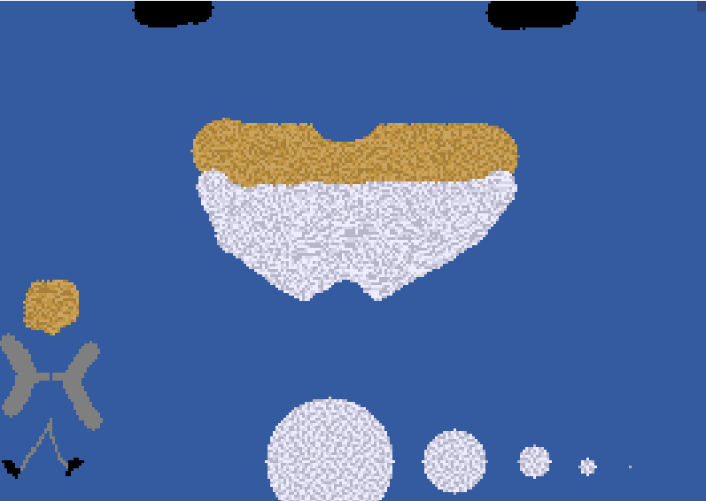
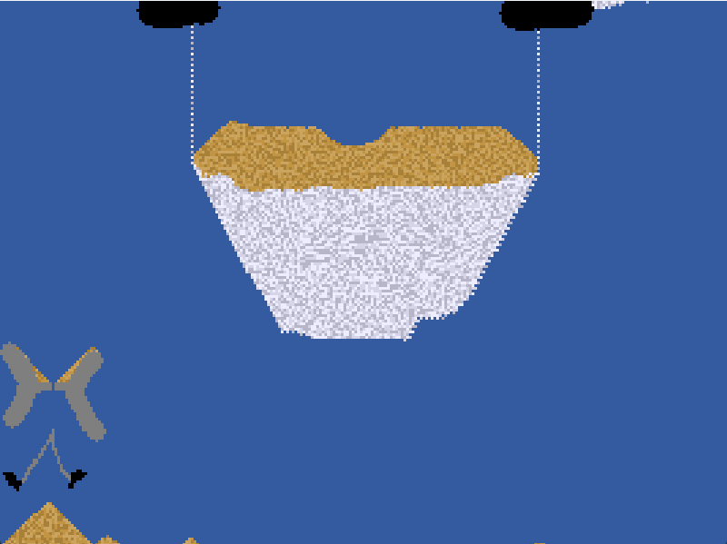
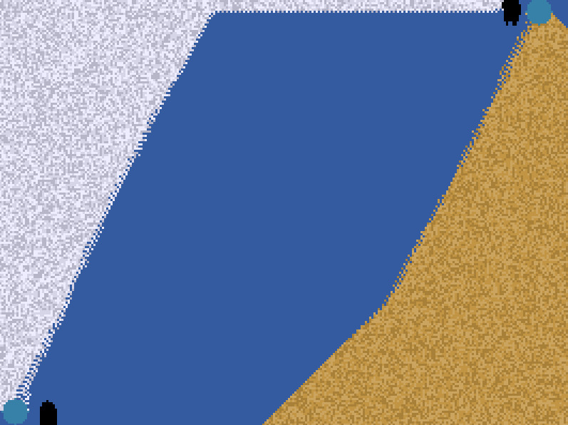

---
- Use the left mouse button to place sand, smoke, or solid.
- Use the right mouse button to remove blocks or to place void.
- Use the T key to change between placing sand and smoke (indicated in the top right).
- Use the Y key to change between sand/delete and solid/void (indicated in the top right).
- Use SPACE bar to pause.
- Use C to clear the grid.
- Change the cursor size using the 1, 2, 3, 4, and 5 keys on the keyboard.
- Use A to place sand source, and B to place smoke source.
- Use Q, W, and E to make it rain.
---

